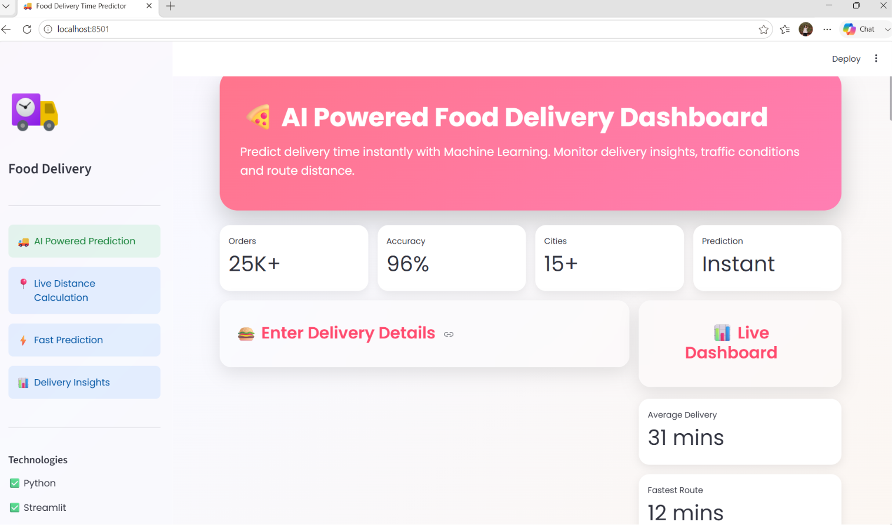
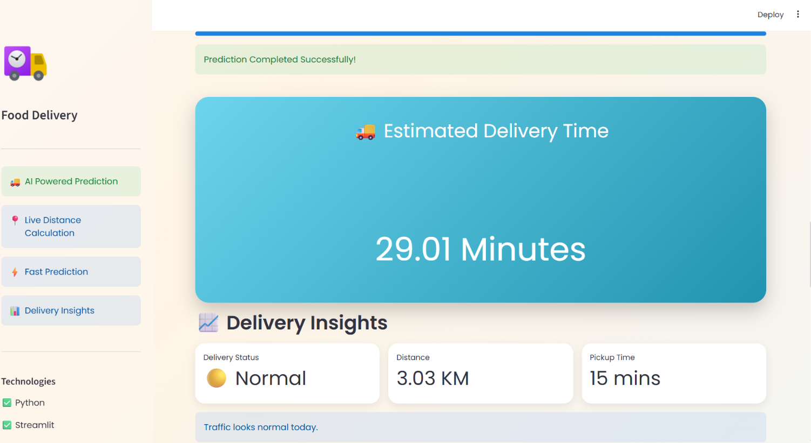

<<<<<<< HEAD
# 🍕 AI-Powered Food Delivery Time Prediction

A Machine Learning web application built with **Python**, **Scikit-learn**, and **Streamlit** that predicts food delivery time using real-world delivery factors such as weather, traffic, distance, vehicle type, and delivery partner information.

---

## 📸 Project Preview

### 🏠 Dashboard



---

### 🚚 Prediction Result



---

## ✨ Features

- 🤖 AI-powered delivery time prediction
- 📍 Automatic distance calculation using the Haversine Formula
- 🌦 Weather and traffic analysis
- 🚗 Vehicle and order information
- 🏙 City-wise prediction
- 📅 Order date and pickup time inputs
- 📊 Interactive delivery insights
- 📈 ETA visualization
- 💎 Modern glassmorphism-inspired UI
- 📱 Responsive Streamlit interface

---

## 🛠️ Tech Stack

- Python
- Streamlit
- Scikit-learn
- Pandas
- NumPy
- Plotly

---

## 📂 Project Structure

```text
Food-Delivery-Time-Prediction/
│
├── app.py
├── food_delivery_model.pkl
├── scaler.pkl
├── label_encoders.pkl
├── train.csv
├── test.csv
├── requirements.txt
├── README.md
│
└── screenshots/
    ├── dashboard.png
    └── prediction.png
```

---

## ⚙️ Installation

Clone the repository:

```bash
git clone https://github.com/yourusername/Food-Delivery-Time-Prediction.git
```

Go to the project folder:

```bash
cd Food-Delivery-Time-Prediction
```

Install dependencies:

```bash
pip install -r requirements.txt
```

Run the application:

```bash
streamlit run app.py
```

---

## 📊 Model Input Features

- Delivery Person Age
- Delivery Person Ratings
- Restaurant Latitude & Longitude
- Delivery Location Latitude & Longitude
- Weather Conditions
- Road Traffic Density
- Vehicle Condition
- Type of Order
- Type of Vehicle
- Multiple Deliveries
- Festival
- City
- Order Date
- Order Time
- Pickup Time
- Distance (Calculated)

---

## 🔄 Machine Learning Pipeline

1. Data Cleaning
2. Feature Engineering
3. Label Encoding
4. Distance Calculation
5. Feature Scaling
6. Model Training
7. Prediction
8. Streamlit Deployment

---

## 🚀 Future Improvements

- Google Maps integration
- Real-time weather API
- Live traffic updates
- Prediction history
- Cloud deployment

---

## 👩‍💻 Author

**Sejal Patole**

=======
# 🍕 AI-Powered Food Delivery Time Prediction

A Machine Learning web application built with **Python**, **Scikit-learn**, and **Streamlit** that predicts food delivery time using real-world delivery factors such as weather, traffic, distance, vehicle type, and delivery partner information.

---

## 📸 Project Preview

### 🏠 Dashboard


---

### 🚚 Prediction Result


---

## ✨ Features

- 🤖 AI-powered delivery time prediction
- 📍 Automatic distance calculation using the Haversine Formula
- 🌦 Weather and traffic analysis
- 🚗 Vehicle and order information
- 🏙 City-wise prediction
- 📅 Order date and pickup time inputs
- 📊 Interactive delivery insights
- 📈 ETA visualization
- 💎 Modern glassmorphism-inspired UI
- 📱 Responsive Streamlit interface

---

## 🛠️ Tech Stack

- Python
- Streamlit
- Scikit-learn
- Pandas
- NumPy
- Plotly

---

## 📂 Project Structure

```text
Food-Delivery-Time-Prediction/
│
├── app.py
├── food_delivery_model.pkl
├── scaler.pkl
├── label_encoders.pkl
├── train.csv
├── test.csv
├── requirements.txt
├── README.md
│
└── screenshots/
    ├── dashboard.png
    └── prediction.png
```

---

## ⚙️ Installation

Clone the repository:

```bash
git clone https://github.com/yourusername/Food-Delivery-Time-Prediction.git
```

Go to the project folder:

```bash
cd Food-Delivery-Time-Prediction
```

Install dependencies:

```bash
pip install -r requirements.txt
```

Run the application:

```bash
streamlit run app.py
```

---

## 📊 Model Input Features

- Delivery Person Age
- Delivery Person Ratings
- Restaurant Latitude & Longitude
- Delivery Location Latitude & Longitude
- Weather Conditions
- Road Traffic Density
- Vehicle Condition
- Type of Order
- Type of Vehicle
- Multiple Deliveries
- Festival
- City
- Order Date
- Order Time
- Pickup Time
- Distance (Calculated)

---

## 🔄 Machine Learning Pipeline

1. Data Cleaning
2. Feature Engineering
3. Label Encoding
4. Distance Calculation
5. Feature Scaling
6. Model Training
7. Prediction
8. Streamlit Deployment

---

## 🚀 Future Improvements

- Google Maps integration
- Real-time weather API
- Live traffic updates
- Prediction history
- Cloud deployment

---

## 👩‍💻 Author

**Sejal Patole**

>>>>>>> daa0d739126036a05ad4a0800af5dea6b74b7e7a
Built with ❤️ using Python, Streamlit, and Machine Learning.